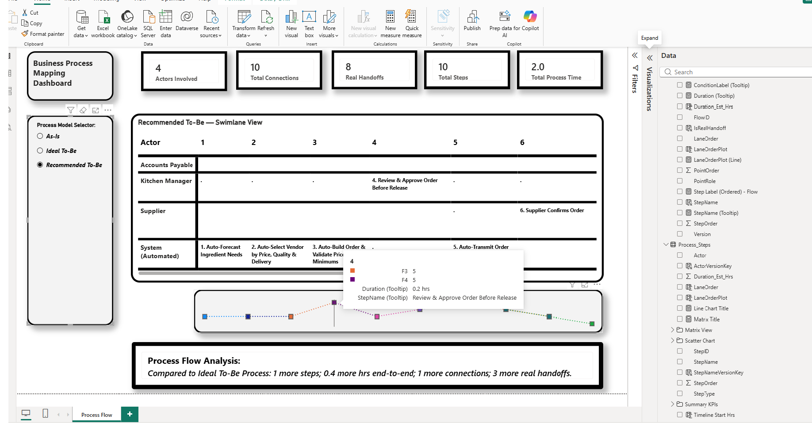

# BPR Process Mapping Framework
### A reusable Power BI + Excel framework for As-Is documentation, Ideal-to-Be redesign, and Recommended-to-Be planning

## Overview

This project is a data-driven swimlane process mapping tool built in Power BI, designed to support the core stages of classic Business Process Reengineering (BPR):

- **As-Is** — capture the current state of a process exactly as it runs today
- **Ideal To-Be** — a clean-sheet redesign, unconstrained by current staffing, systems, or politics
- **Recommended To-Be** — the ideal design pulled back to what's actually implementable given real-world constraints

Rather than hand-drawing swimlane diagrams in Visio or PowerPoint, this project models a process as structured, relational data — steps, actors, sequences, durations — so the diagram, the KPIs, and the narrative summary are all *derived*, not manually maintained. Change a value in Excel, hit refresh, and every visual updates.

## Why this exists

Most process documentation is static: a diagram gets drawn once and goes stale the moment the process changes. This project treats process mapping as a **data modeling problem**, not a drawing problem — which means:

- Process improvements can be measured, not just described
- Multiple process versions (As-Is, Ideal, Recommended) can be compared side-by-side on identical visuals
- The same framework is reusable across completely unrelated processes just by swapping the source data

## Key Features

- **Swimlane Matrix view** — activity-level process view: who does what, in what order, color- and icon-coded by activity type (Task / Decision / Document / Database)
- **Flow diagram (Line + Scatter hybrid)** — shows sequence, branching, convergence, and rework loops, with hover tooltips for step name, duration, and branch condition
- **Real Handoff Count** — a computed metric that identifies genuine cross-role handoffs (lane-crossing transitions), distinct from a simple step count
- **True Process Duration** — critical-path-based end-to-end duration, correctly treating parallel branches as concurrent rather than additive — a materially more accurate metric than a naive sum of all step durations
- **Version comparison** — a single slicer flips between As-Is / Ideal To-Be / Recommended To-Be, with every visual and KPI updating automatically
- **Auto-generated narrative summary** — a DAX-driven card that writes a plain-language comparison ("Compared to As-Is Process: 7 fewer steps; 3.4 fewer hrs end-to-end...") for whichever version is selected
- **Reusable template architecture** — the Power BI file (model, relationships, measures, visuals) never changes between projects; only the Excel source data does

<h3>📷 Project Preview</h3>

<table>
  <tr>
    <td></td>
    <td></td>
  </tr>
  <tr>
    <td></td>
    <td></td>
  </tr>
</table>

## Data Model

Four core tables, plus a small versioning layer:

| Table | Purpose |
|---|---|
| `Process_Steps` | One row per process step: name, sequence order, owning actor, activity type, estimated duration |
| `Swimlane` | One row per actor/role and its lane position |
| `SequenceFlow` | One row per transition between two steps (the edges connecting the process graph), including branch condition labels |
| `Flow_Points` | Derived via Power Query (merge + unpivot) from the above three tables — flattens each flow into plotting-ready start/end coordinates |
| `VersionTable` | Standalone dimension table distinguishing As-Is / Ideal To-Be / Recommended To-Be |

**Design decisions worth noting:**
- `SequenceFlow` has two logical relationships back to `Process_Steps` (from-step and to-step) — a classic role-playing dimension, resolved via `USERELATIONSHIP()`
- Every relationship uses a **composite key** (e.g., step name + version) rather than a plain name field, since step and actor names legitimately repeat across different process versions
- A swimlane (Matrix) was deliberately chosen over a plain flowchart because **ownership and handoffs** — not just sequence — are the actual unit of analysis in a BPR exercise

## Methodology: Why Three Versions, Not an Endless Chain

Early iterations of this project explored an open-ended V1→V2→V3→...→Vn continuous-improvement model (closer to Lean/Kaizen). The project was deliberately scoped back to the three-model BPR structure — As-Is, Ideal To-Be, Recommended To-Be — to stay consistent with classic BPR methodology (Hammer & Champy) rather than blending it with a different improvement philosophy. A Lean/Value-Stream-Mapping layer (value-add classification, wait-time capture, process cycle efficiency) is scoped as a deliberate next tier, not part of this project.

## Reusable Framework

The Power BI file is case-study-agnostic. To document a new process:

1. Copy the blank Excel template (`Process_Steps_V1/V2/V3`, `Swimlane_V1/V2/V3`, `SequenceFlow_V1/V2/V3`)
2. Populate it with the new process's steps, actors, and flows
3. In Power BI: Home → Transform Data → Data source settings → Change Source → point at the new file
4. Refresh — the model, relationships, and every visual recompute automatically

This was validated by loading two structurally unrelated processes (an IT service desk incident workflow and a warehouse truck-receiving workflow) into the same, unmodified Power BI file.

**One modeling rule to know when authoring new process data by hand:** a single actor cannot repeat the same step-order position twice (two *different* actors sharing a step-order is fine — that's how parallel branches are represented).

## Tools Used

- Power BI Desktop (data model, DAX, report visuals)
- Power Query (M) for data shaping and the version auto-stacking logic
- Excel (source data authoring, with Data Validation to reduce entry errors)

